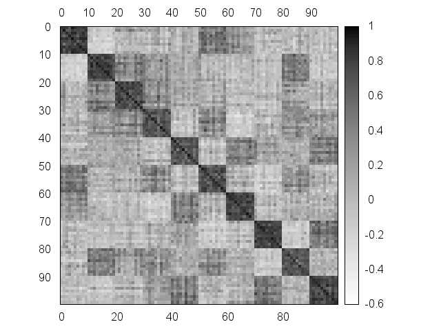

# Similar Images

## references

- Representational Distance Learning  for Deep Neural Networks: https://arxiv.org/pdf/1511.03979.pdf
- Siamese Networks: http://vision.ia.ac.cn/zh/senimar/reports/Siamese-Network-Architecture-and-Applications-in-Computer-Vision.pdf

## MNIST

- same digits -> similarity=1
- different digits -> similarity=0

## 予定

1. 二次元画像で学習する
1. illust2vec の pretrained モデルが使えるかもしれない

